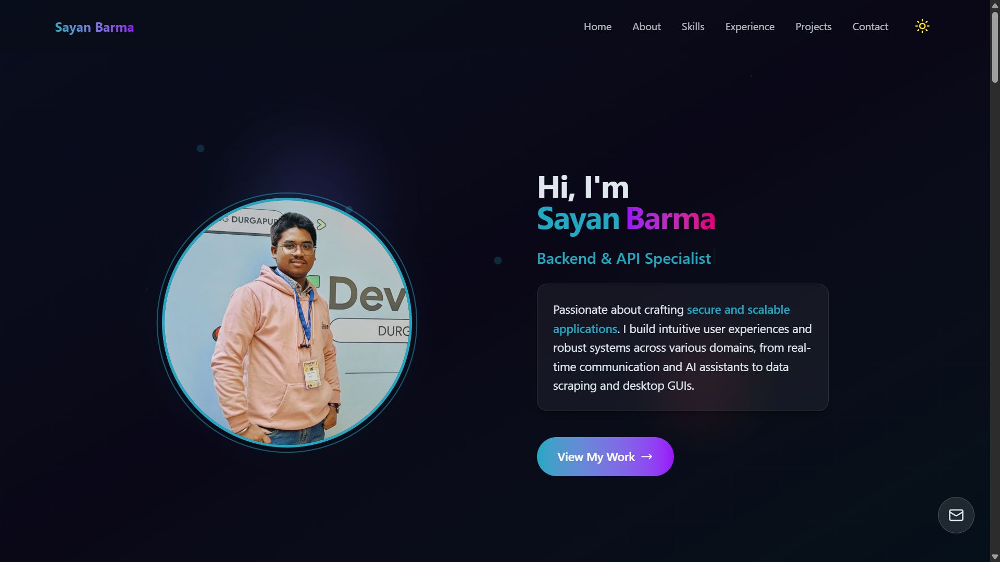

# 🚀 Sayan Barma | Portfolio

A modern, responsive portfolio website built with React, Vite, and Tailwind CSS. Features smooth animations, SEO optimization, and PWA capabilities.



## ✨ Features

- **🎨 Modern Design**: Clean, professional interface with glassmorphism effects
- **📱 Fully Responsive**: Optimized for all device sizes
- **⚡ Fast Performance**: Built with Vite for lightning-fast builds
- **🎭 Smooth Animations**: Framer Motion animations with performance optimization
- **🔍 SEO Optimized**: Complete meta tags, structured data, and sitemap
- **📊 PWA Ready**: Web app manifest and service worker support
- **🌙 Theme Support**: Dark theme with orange accent colors
- **♿ Accessible**: ARIA labels and semantic HTML structure
- **🚀 Netlify Ready**: Configured for seamless deployment

## 🛠️ Tech Stack

### Frontend

- **React 18.3.1** - Modern React with hooks
- **Vite 5.3.4** - Fast build tool and dev server
- **Tailwind CSS 4.1.4** - Utility-first CSS framework
- **Framer Motion 12.23.6** - Smooth animations and transitions
- **React Router DOM 7.5.1** - Client-side routing

### UI Components

- **Lucide React** - Beautiful icons
- **Radix UI** - Accessible component primitives
- **React Typed** - Typewriter effect animations

### Development

- **ESLint** - Code linting and formatting
- **PostCSS** - CSS processing
- **Vite Plugin SSR** - Server-side rendering support

## 📁 Project Structure

```
portfolio-react/
├── public/                    # Static assets
│   ├── data/                 # JSON data files
│   │   ├── experience.json   # Work experience data
│   │   └── projects.json     # Projects data
│   ├── projects/             # Project images
│   ├── logos/               # Company/organization logos
│   ├── favicon.ico          # Site favicon
│   ├── manifest.json        # PWA manifest
│   ├── sitemap.xml          # SEO sitemap
│   ├── robots.txt           # Search engine directives
│   └── resume.pdf           # Resume file
├── src/
│   ├── components/          # React components
│   │   ├── effects/         # Visual effects (cursor trail, etc.)
│   │   ├── layout/          # Layout components (navbar, footer)
│   │   ├── navigation/      # Navigation components
│   │   ├── sections/        # Page sections (hero, about, etc.)
│   │   └── ui/              # Reusable UI components
│   ├── hooks/               # Custom React hooks
│   ├── lib/                 # Utility libraries
│   ├── pages/               # Page components
│   └── utils/               # Helper functions
├── scripts/                 # Build and deployment scripts
│   └── generate-static.js   # SEO enhancement script
├── netlify.toml            # Netlify configuration
└── BUILD.md                # Detailed build guide
```

## 🚀 Quick Start

### Prerequisites

- Node.js 18.x or higher
- npm or yarn

### Installation

1. **Clone the repository**

   ```bash
   git clone https://github.com/N00BSC00B/portfolio-react.git
   cd portfolio-react
   ```

2. **Install dependencies**

   ```bash
   npm install
   ```

3. **Start development server**

   ```bash
   npm run dev
   ```

4. **Open in browser**
   ```
   http://localhost:5173
   ```

## 📜 Available Scripts

### Development

```bash
npm run dev          # Start development server
npm run preview      # Preview production build locally
npm run lint         # Run ESLint code checking
```

### Production

```bash
npm run build        # Standard production build
npm run build:seo    # SEO-optimized build (Recommended)
npm run build:ssr    # SSR-enhanced build (Future feature)
```

### Deployment

```bash
npm run predeploy    # Automatically runs build:seo
npm run deploy       # Deploy to GitHub Pages (legacy)
```

## 🌐 Deployment

### Netlify (Recommended)

1. **Connect GitHub repository** to Netlify
2. **Build settings:**
   - Build Command: `npm run build:seo`
   - Publish Directory: `dist`
   - Node Version: `18`
3. **Deploy!**

The site includes:

- Automatic redirects for SPA routing
- Optimized headers for performance
- SEO-enhanced HTML generation

### Manual Deployment

```bash
npm run build:seo
# Upload dist/ folder to your hosting provider
```

## 🔧 Configuration

### Environment Variables

Create a `.env` file for local development:

```env
VITE_WEBHOOK_URL="your-discord-webhook-url"
```

### Customization

#### Personal Information

Update the following files with your information:

- `public/data/experience.json` - Work experience
- `public/data/projects.json` - Project portfolio
- `public/resume.pdf` - Your resume
- `src/components/sections/` - Section content

#### Styling

- `src/index.css` - Global styles and theme colors
- `tailwind.config.js` - Tailwind configuration
- Component files - Individual component styles

#### SEO

Update URLs in:

- `package.json` - Homepage field
- `scripts/generate-static.js` - All meta tag URLs
- `public/sitemap.xml` - Sitemap URLs

## 📊 Performance Features

### SEO Optimization

- **Complete meta tags** (Open Graph, Twitter Cards)
- **Structured data** (Schema.org markup)
- **Sitemap** and robots.txt
- **Server-side rendering** support
- **Performance-optimized** builds

### PWA Features

- **Web app manifest** for installation
- **Offline support** ready
- **App shortcuts** for quick navigation
- **Theme color** customization

### Performance

- **Code splitting** ready
- **Image optimization** support
- **Caching headers** configured
- **Bundle analysis** available

## 🎨 Design System

### Colors

- **Primary**: Orange (#EA580C)
- **Background**: Dark blue (#0A0E1A)
- **Text**: Light colors for contrast
- **Accents**: Glass morphism effects

### Typography

- **Headings**: Large, bold typography
- **Body**: Clean, readable fonts
- **Code**: Monospace for technical content

### Components

- **Glass morphism cards** for content sections
- **Smooth animations** for interactions
- **Responsive design** for all devices
- **Accessible** color contrasts

## 👨‍💻 About

**Sayan Barma** - Full-Stack & AI Developer

- 🌐 Website: [sayan-barma-portfolio.netlify.app](https://sayan-barma-portfolio.netlify.app)
- 💼 LinkedIn: [sayan-barma-ab0973289](https://www.linkedin.com/in/sayan-barma-ab0973289/)
- 🐱 GitHub: [N00BSC00B](https://github.com/N00BSC00B)
- 📧 Email: sayanbarma2004@gmail.com

## 🙏 Acknowledgments

- **React Team** for the amazing framework
- **Vite** for the blazing fast build tool
- **Tailwind CSS** for the utility-first CSS framework
- **Framer Motion** for smooth animations
- **Netlify** for seamless deployment

---

<div align="center">

**⭐ Star this repo if you found it helpful!**

Made with ❤️ by [Sayan Barma](https://github.com/N00BSC00B)

</div>
